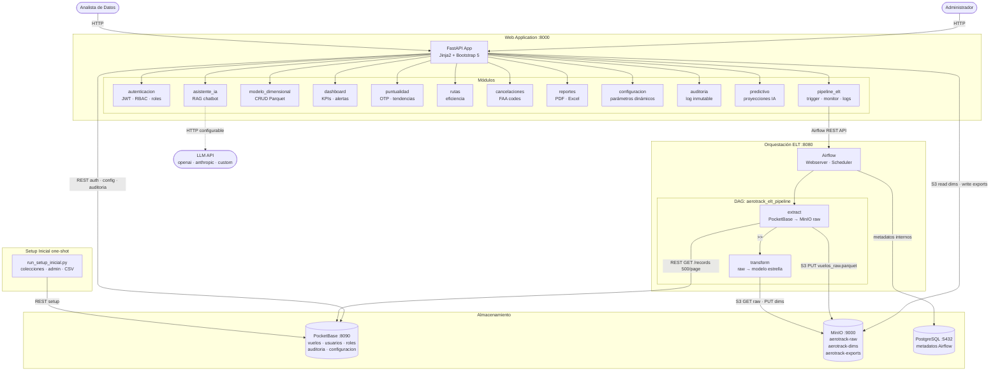
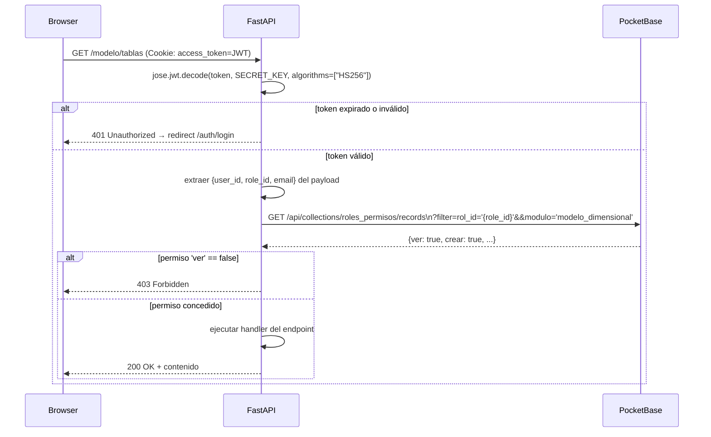
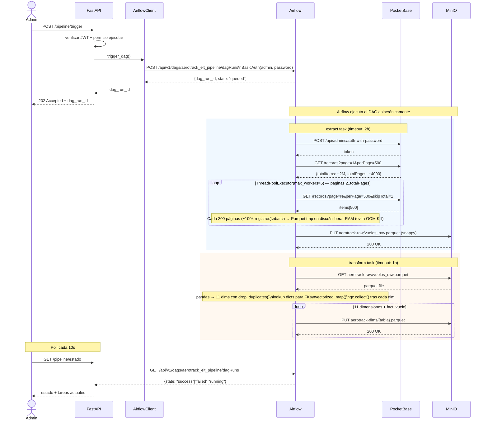
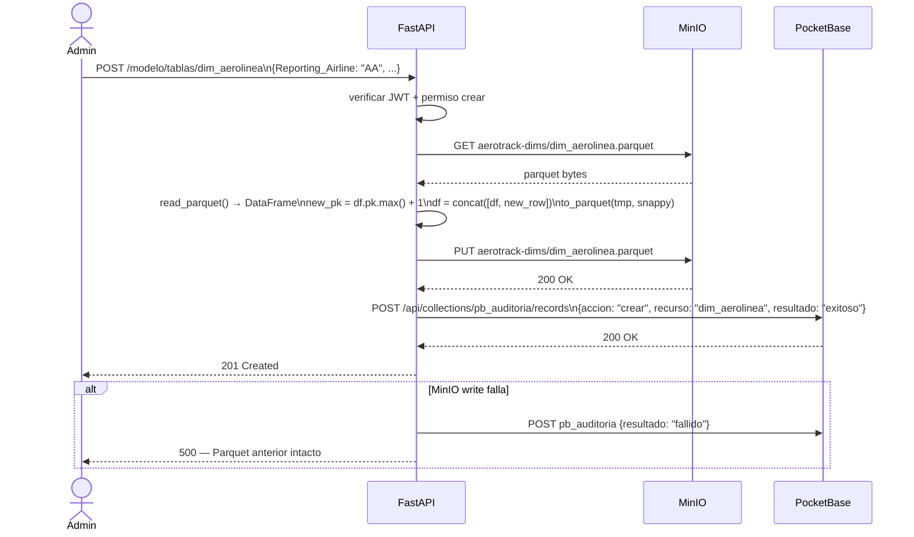
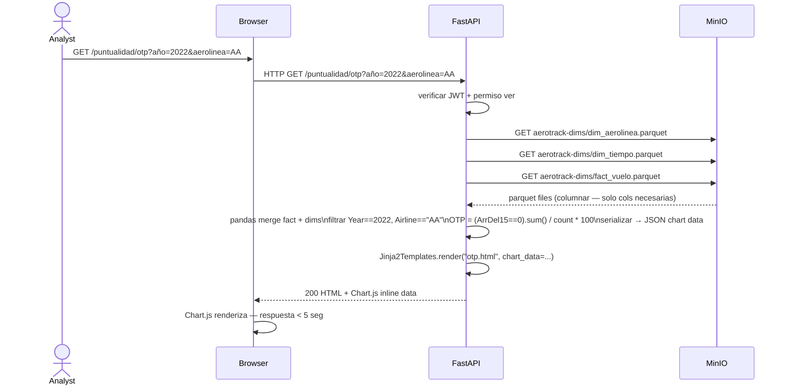
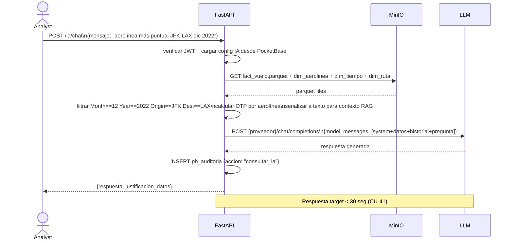

# AeroTrack Analytics — Technical Design

## Overview

AeroTrack Analytics sigue una arquitectura de tres capas desacopladas: un pipeline ELT asíncrono orquestado por Airflow extrae 2M vuelos de PocketBase (SQLite), los transforma al modelo estrella de Kimball y los persiste como Parquet comprimido en MinIO. Una aplicación FastAPI + Jinja2 consume esos Parquet para análisis y gestiona los datos operativos (usuarios, roles, auditoría, configuración) directamente contra PocketBase vía REST. El control de acceso RBAC vive en capa de aplicación — no hay GRANTs SQL — porque MinIO no es BD relacional y PocketBase solo permite permisos por colección completa. Todos los servicios corren en contenedores Docker aislados en la red `elt-network`.

---

## Architecture

### Component Diagram



### Storage Architecture

**MinIO — Analytical Layer (Parquet)**

MinIO expone la API S3 estándar. El pipeline ELT escribe los Parquet; la webapp los lee para análisis. No existen FKs entre capas — la integridad se verifica por proceso (CU-16).

| Bucket | Variable | Escrito por | Leído por | Contenido |
|---|---|---|---|---|
| `aerotrack-raw` | `MINIO_BUCKET_RAW` | DAG extract task | DAG transform task | `vuelos_raw.parquet` — copia plana de PocketBase |
| `aerotrack-dims` | `MINIO_BUCKET_DIMS` | DAG transform task | FastAPI (análisis, CRUD) | `fact_vuelo.parquet` + 11 `dim_*.parquet` |
| `aerotrack-exports` | `MINIO_BUCKET_EXPORTS` | FastAPI (reportes, predictivo) | Usuarios (descarga) | PDFs y `.xlsx` generados bajo demanda |

**PocketBase — Operational Layer (SQLite interno)**

PocketBase v0.22.4 gestiona todos los datos operativos vía REST API en `:8090`.

| Colección | Propósito |
|---|---|
| `vuelos_raw` | Datos crudos del CSV airline_2m — fuente del pipeline ELT |
| `app_users` | Usuarios del sistema: nombre, email, password (bcrypt), rol, activo |
| `roles` | Definición de roles; `es_sistema=true` protege roles del sistema |
| `modulos` | Módulos registrados del sistema (usado por el RBAC dinámico) |
| `roles_permisos` | Matriz RBAC: FK rol + FK módulo + acciones (ver, crear, editar, eliminar, ejecutar, exportar, configurar) |
| `configuracion_sistema` | Parámetros dinámicos: SMTP, umbrales alertas, pipeline, IA — con flag `sensible` |
| `pb_auditoria` | Log de auditoría inmutable (INSERT-only): user_id, accion, modulo, recurso, resultado, timestamp |

**PostgreSQL — Airflow Metadata Only**

Almacena exclusivamente los metadatos internos de Airflow (DAG runs, task instances, XComs). No es accesible por la webapp FastAPI.

### Environment Detection Pattern

```python
# app/config.py — patrón real del proyecto
import os

IN_DOCKER = os.path.exists("/.dockerenv")

# Contenedores se resuelven por nombre de servicio Docker
# El host anfitrión usa localhost
MINIO_ENDPOINT = "minio:9000"                    if IN_DOCKER else "localhost:9000"
PB_URL         = "http://pocketbase:8090"        if IN_DOCKER else "http://localhost:8090"
AIRFLOW_URL    = "http://airflow-webserver:8080" if IN_DOCKER else "http://localhost:8080"
```

El mismo patrón se replica en `scripts/config.py` y `dags/config.py` para sus respectivos contextos de ejecución.

### Configuration System

El sistema usa dos capas de configuración:

- **`.env`** — solo credenciales de infraestructura (claves MinIO, SECRET_KEY, credenciales PocketBase/Airflow). Nunca persisten en BD.
- **`configuracion_sistema` en PocketBase** — todos los parámetros de negocio que el Admin puede cambiar desde la UI sin reiniciar servicios.

| Grupo | Claves clave |
|---|---|
| `email` | smtp_host, smtp_port, remitente, password\*, tls, alertas_activas, destinatario |
| `alertas` | otp_minimo (80%), cancelacion_maxima (5%), minutos_retraso (15), desviacion_ruta (15%) |
| `pipeline` | batch_size (5000), max_workers (6), reintentos (3) |
| `ia` | proveedor, api_key\*, modelo, endpoint_custom, max_tokens, temperatura, timeout, modulo_activo |
| `sistema` | token_expire_minutes, nombre_sistema, horizonte_prediccion_max |

\* `sensible=true` → enmascarado con •••• en UI

### Application Package Structure

Cada subdirectorio de `app/` es un paquete Python independiente con responsabilidad única. La regla general: **ningún archivo Python vive suelto en la raíz del módulo** — todo se agrupa en subcarpetas por función. Las templates HTML van **dentro del módulo al que pertenecen**, no en un directorio centralizado.

#### Convención de subcarpetas por módulo

| Carpeta dentro del módulo | Contenido |
|---|---|
| `router.py` | Punto de entrada del módulo — registra todos los endpoints. Importa desde las subcarpetas. |
| `<función>/` | Subcarpeta con un `__init__.py` que agrupa archivos relacionados (ej. `jwt/`, `rbac/`, `clients/`, `data/`) |
| `templates/` | Templates Jinja2 propios del módulo. Sin `__init__.py` — no es paquete Python. |

#### Estructura real de Entrega 1

```
app/
├── config.py                       # Variables de entorno centralizadas
├── main.py                         # FastAPI app — registra routers de todos los módulos
│
├── autenticacion/                  # Seguridad: JWT, RBAC, usuarios, roles
│   ├── router.py                   # login, logout, perfil
│   ├── jwt/
│   │   └── service.py              # crear_token(), verificar_token()
│   ├── rbac/
│   │   ├── permisos.py             # endpoints /auth/permisos y /auth/roles/{id}/permisos
│   │   └── roles_admin.py          # endpoints /auth/roles CRUD
│   ├── usuarios/
│   │   └── usuarios.py             # endpoints /auth/usuarios CRUD
│   └── templates/
│       ├── login.html / perfil.html
│       ├── roles/  (form, lista, matriz, permisos)
│       └── usuarios/  (form, lista)
│
├── pipeline_elt/                   # Control del DAG Airflow desde la UI
│   ├── router.py                   # endpoints /pipeline/*
│   ├── clients/
│   │   └── airflow_client.py       # httpx async — Airflow REST API
│   └── templates/pipeline/  (panel, historial, logs)
│
├── modelo_dimensional/             # CRUD Parquet de las 12 tablas del modelo estrella
│   ├── router.py                   # endpoints /modelo/*
│   ├── data/
│   │   └── service.py              # read/write Parquet, paginación, validación FK
│   └── templates/modelo_dimensional/  (lista_tablas, lista_registros, form, detalle, validacion)
│
└── shared/                         # Código reutilizable — NO contiene rutas ni lógica de negocio
    ├── deps.py                     # Dependencias FastAPI: get_current_user, require_permission, render()
    ├── templates.py                # Instancia Jinja2 multi-directorio + TABLAS + MODULOS_SIDEBAR
    ├── clients/
    │   ├── pb_client.py            # Cliente HTTP síncrono para PocketBase REST API
    │   └── minio_client.py         # read_parquet, write_parquet, stat_parquet
    ├── utils/
    │   ├── audit.py                # registrar() — INSERT-only en pb_auditoria
    │   ├── email_utils.py          # send_welcome_email() via SMTP
    │   └── password_utils.py       # generar_contrasena_temporal()
    └── templates/
        ├── base.html               # Layout base Bootstrap 5 con sidebar dinámico
        └── error.html              # Página de error genérica (403, 404, 500)
```

#### El módulo `shared/` — código compartido sin duplicar

`shared/` es la única carpeta que **todos los módulos pueden importar**. Su propósito es evitar duplicación de código transversal. Las reglas de lo que pertenece aquí:

- **`shared/clients/`** — clientes de servicios externos (PocketBase, MinIO). Un solo cliente por servicio, importado por cualquier módulo que lo necesite. Ningún módulo crea su propio cliente HTTP.
- **`shared/utils/`** — funciones utilitarias sin estado que no pertenecen a ningún módulo en particular: auditoría, email, contraseñas.
- **`shared/deps.py`** — dependencias FastAPI reutilizables: decodificación JWT, verificación de permisos, helper `render()` que inyecta el sidebar automáticamente.
- **`shared/templates.py`** — única fuente de verdad para: instancia `Jinja2Templates`, catálogo de tablas (`TABLAS`), módulos del sidebar (`MODULOS_SIDEBAR`), tamaño de página (`PAGE_SIZE`).
- **`shared/templates/`** — templates base compartidos entre módulos (`base.html`, `error.html`). Los módulos los heredan con ``.

Lo que **no** pertenece en `shared/`: routers, lógica de negocio específica de un módulo, modelos de datos de un dominio concreto.

#### Carga de templates multi-directorio

Jinja2 busca templates en este orden de directorios:

```python
# shared/templates.py
templates.env.loader = FileSystemLoader([
    "shared/templates",              # base.html, error.html (1º — mayor prioridad)
    "autenticacion/templates",       # login.html, perfil.html, roles/, usuarios/
    "pipeline_elt/templates",        # pipeline/panel.html, historial.html, logs.html
    "modelo_dimensional/templates",  # modelo_dimensional/*.html
])
```

Los nombres de template en el código (`render(request, "roles/lista.html", ...)`) se resuelven contra esta lista. Al agregar módulos en Entregas 2-3 se añade su directorio al loader.

### Delivery Plan

| Package | Entrega | Status | Dependencies |
|---------|---------|--------|--------------|
| `seguridad` | E1 | IN PROGRESS | PocketBase: app_users, roles, roles_permisos, modulos |
| `pipeline_elt` | E1 | IN PROGRESS | Airflow DAG `aerotrack_elt_pipeline`, MinIO, PocketBase |
| `modelo_dimensional` | E1 | IN PROGRESS | MinIO aerotrack-dims |
| `dashboard` | E2 | TODO | modelo_dimensional completo |
| `puntualidad` | E2 | TODO | modelo_dimensional completo |
| `rutas` | E2 | TODO | modelo_dimensional completo |
| `cancelaciones` | E2 | TODO | modelo_dimensional completo |
| `reportes` | E2 | TODO | dashboard, puntualidad, rutas, cancelaciones |
| `configuracion` | E2 | TODO | PocketBase: configuracion_sistema |
| `auditoria` | E2 | TODO | PocketBase: pb_auditoria |
| `predictivo` | E3 | TODO | dashboard + puntualidad (historial ≥ 12 meses) |
| `asistente_ia` | E3 | TODO | predictivo + configuracion (grupo 'ia') |
| `auxiliar` | futuro | PLACEHOLDER | — |

---

## Components and Interfaces

### API Endpoints

Prefijos registrados en `app/main.py`: `/auth`, `/pipeline`, `/modelo`, `/dashboard`, `/puntualidad`, `/rutas`, `/cancelaciones`, `/reportes`, `/configuracion`, `/auditoria`, `/predictivo`, `/ia`

| Method | Route | Auth | Package | CU | Description |
|--------|-------|------|---------|-----|-------------|
| `POST` | `/auth/login` | No | autenticacion | CU-01 | Validate credentials vs PocketBase, return JWT cookie |
| `POST` | `/auth/logout` | JWT | autenticacion | CU-02 | Invalidate token, clear session cookie |
| `GET` | `/auth/perfil` | JWT | autenticacion | CU-03 | Get own profile |
| `PUT` | `/auth/perfil/password` | JWT | autenticacion | CU-03 | Change own password (requires current password) |
| `GET` | `/auth/usuarios` | Admin+ver | autenticacion | CU-04 | List users with pagination and filters |
| `POST` | `/auth/usuarios` | Admin+crear | autenticacion | CU-04 | Create user |
| `PUT` | `/auth/usuarios/{id}` | Admin+editar | autenticacion | CU-04 | Edit user name/email/role |
| `PUT` | `/auth/usuarios/{id}/estado` | Admin+editar | autenticacion | CU-04 | Toggle activo with modal confirmation |
| `GET` | `/auth/roles` | Admin+ver | autenticacion | CU-05..07 | List roles |
| `POST` | `/auth/roles` | Admin+crear | autenticacion | CU-05 | Create role (empty permissions) |
| `PUT` | `/auth/roles/{id}` | Admin+editar | autenticacion | CU-06 | Edit role name/description |
| `DELETE` | `/auth/roles/{id}` | Admin+eliminar | autenticacion | CU-07 | Delete role (blocked if users assigned) |
| `GET` | `/auth/roles/{id}/permisos` | Admin+ver | autenticacion | CU-08..09 | Get role permissions grid |
| `PUT` | `/auth/roles/{id}/permisos` | Admin+configurar | autenticacion | CU-08 | Save role permissions |
| `GET` | `/auth/permisos/matriz` | Admin+ver | autenticacion | CU-09 | Read-only permission matrix |
| `POST` | `/pipeline/trigger` | Admin+ejecutar | pipeline_elt | CU-10 | Trigger `aerotrack_elt_pipeline` DAG via Airflow REST |
| `GET` | `/pipeline/estado` | Admin+ver | pipeline_elt | CU-11 | Current DAG run status |
| `GET` | `/pipeline/historial` | Admin+ver | pipeline_elt | CU-12 | DAG run history table |
| `GET` | `/pipeline/logs/{run_id}/{task_id}` | Admin+ver | pipeline_elt | CU-13 | Task error logs |
| `GET` | `/modelo/tablas` | Admin+ver | modelo_dimensional | CU-14 | List 12 tables with record count and Parquet size |
| `GET` | `/modelo/tablas/{nombre}` | Admin+ver | modelo_dimensional | CU-15 | Paginated records (50/page) with search |
| `POST` | `/modelo/tablas/{nombre}` | Admin+crear | modelo_dimensional | CU-15 | Create record in Parquet |
| `PUT` | `/modelo/tablas/{nombre}/{pk}` | Admin+editar | modelo_dimensional | CU-15 | Edit record (PK read-only) |
| `DELETE` | `/modelo/tablas/{nombre}/{pk}` | Admin+eliminar | modelo_dimensional | CU-15 | Delete record (blocked if pk=0) |
| `POST` | `/modelo/validar` | Admin+ejecutar | modelo_dimensional | CU-16 | Run FK integrity validation |
| `GET` | `/dashboard/kpis` | Analista+ver | dashboard | CU-17 | KPIs: OTP, total flights, cancellation rate, avg delay |
| `GET` | `/puntualidad/otp` | Analista+ver | puntualidad | CU-19 | OTP by airline bar chart data |
| `GET` | `/puntualidad/tendencias` | Analista+ver | puntualidad | CU-21 | OTP trend line by month/day-of-week |
| `GET` | `/rutas/ranking` | Analista+ver | rutas | CU-22 | Route efficiency ranking |
| `GET` | `/cancelaciones/causas` | Analista+ver | cancelaciones | CU-24 | Cancellations by FAA code pie chart data |
| `POST` | `/reportes/pdf` | Analista+exportar | reportes | CU-27 | Generate PDF → upload MinIO exports → return link |
| `POST` | `/reportes/excel` | Analista+exportar | reportes | CU-28 | Generate .xlsx → direct download |
| `GET` | `/configuracion` | Admin+ver | configuracion | CU-29 | All config groups |
| `PUT` | `/configuracion/{grupo}` | Admin+configurar | configuracion | CU-30..32 | Save config group |
| `POST` | `/configuracion/email/test` | Admin+configurar | configuracion | CU-30 | Send test email via SMTP |
| `GET` | `/configuracion/estado` | Admin+ver | configuracion | CU-34 | Health: MinIO, PocketBase, Airflow |
| `GET` | `/auditoria` | Admin+ver | auditoria | CU-39 | Audit log paginated |
| `GET` | `/auditoria/export` | Admin+exportar | auditoria | CU-40 | Export filtered audit log as CSV |
| `POST` | `/predictivo/proyeccion` | Analista+ejecutar | predictivo | CU-35 | Generate OTP risk projection |
| `GET` | `/predictivo/estacionalidad` | Analista+ver | predictivo | CU-36 | Seasonal heat map data |
| `POST` | `/ia/chat` | Analista+ejecutar | asistente_ia | CU-41 | Natural language query over star model |
| `PUT` | `/configuracion/ia` | Admin+configurar | configuracion | CU-42 | Save LLM provider config |

### Sequence Diagrams

#### Authentication & Authorization Flow

```mermaid
sequenceDiagram
  actor User
  participant Browser
  participant FastAPI
  participant PocketBase

  User->>Browser: POST /auth/login {email, password}
  Browser->>FastAPI: HTTP POST /auth/login

  FastAPI->>PocketBase: POST /api/admins/auth-with-password\n{identity, password}
  PocketBase-->>FastAPI: {token, record: {id, email, rol, activo}}

  alt activo == false
    FastAPI-->>Browser: 403 "Cuenta desactivada. Contacte al administrador"
  else credenciales incorrectas
    FastAPI-->>Browser: 401 mensaje genérico sin revelar campo
  else autenticación exitosa
    FastAPI->>FastAPI: jose.jwt.encode({sub: user_id, role, email, exp: +60min}, SECRET_KEY)
    FastAPI-->>Browser: Set-Cookie: access_token=JWT; HttpOnly\nRedirect 302 /dashboard
  end

  Note over Browser,FastAPI: Todas las peticiones siguientes llevan el JWT en la cookie
```

#### RBAC Permission Check Flow



#### ELT Pipeline Execution Flow



#### CRUD Modelo Dimensional Flow



#### Analytical Query Flow



#### AI Assistant RAG Flow



---

## Data Models

### Modelo Estrella — MinIO Parquet

```python
from typing import TypedDict, Optional

class FactVuelo(TypedDict):
    pk_vuelo: int                     # PK autoincremental
    # Foreign Keys (int32 — 50% menos RAM que int64)
    fk_tiempo: int
    fk_aerolinea: int
    fk_aeropuerto_origen: int
    fk_aeropuerto_destino: int
    fk_avion: int
    fk_ruta: int
    fk_distancia: int
    fk_horario: int
    fk_cancelacion: int
    fk_clasificacion_retraso: int
    fk_retraso_causa: int
    fk_desvio: int
    # Métricas
    AirTime: Optional[float]
    Distance: Optional[float]
    Flights: Optional[int]
    ActualElapsedTime: Optional[float]
    CRSElapsedTime: Optional[float]
    TaxiIn: Optional[float]
    TaxiOut: Optional[float]

# Filas especiales pk=0 en dims opcionales — no eliminables (CU-15)
class DimTiempo(TypedDict):
    pk_tiempo: int
    FlightDate: str        # clave natural (drop_duplicates)
    Year: int; Quarter: int; Month: int
    DayofMonth: int; DayOfWeek: int
    DepTimeBlk: str; ArrTimeBlk: str

class DimAerolinea(TypedDict):
    pk_aerolinea: int
    Reporting_Airline: str # clave natural
    IATA_CODE_Reporting_Airline: str
    DOT_ID_Reporting_Airline: int

class DimAeropuerto(TypedDict):
    pk_aeropuerto: int
    AirportCode: str       # clave natural (Origin y Dest unificados)
    AirportID: int; AirportSeqID: int; CityMarketID: int
    CityName: str; State: str; StateName: str; Wac: int

class DimAvion(TypedDict):
    pk_avion: int
    Tail_Number: str       # clave natural
    DistanceGroup: int; Distance: float

class DimRetraso(TypedDict):         # pk=0 → "Sin retraso"
    pk_retraso_causa: int
    CarrierDelay: float; WeatherDelay: float; NASDelay: float
    SecurityDelay: float; LateAircraftDelay: float
    TotalAddGTime: float; LongestAddGTime: float
    descripcion: str

class DimCancelacion(TypedDict):     # pk=0 → "Vuelo normal"
    pk_cancelacion: int
    Cancelled: int; CancellationCode: str; Diverted: int
    FirstDepTime: float; descripcion: str

class DimDistancia(TypedDict):
    pk_distancia: int
    DistanceGroup: int               # clave natural
    Distance: float; CRSElapsedTime: float; ActualElapsedTime: float

class DimDesvio(TypedDict):          # pk=0 → "Sin desvío"
    pk_desvio: int
    DivAirportLandings: int; DivReachedDest: int
    DivActualElapsedTime: float; DivArrDelay: float; DivDistance: float
    Div1Airport: str; Div1TailNum: str; descripcion: str

class DimHorario(TypedDict):
    pk_horario: int
    CRSDepTime: int                  # clave natural
    DepTime: float; DepDelay: float; DepDelayMinutes: float
    CRSArrTime: int; ArrTime: float; ArrDelay: float; ArrDelayMinutes: float

class DimClasificacionRetraso(TypedDict):
    pk_clasificacion: int
    DepDel15: int; ArrDel15: int
    DepartureDelayGroups: int; ArrivalDelayGroups: int

class DimRuta(TypedDict):
    pk_ruta: int
    OriginCode: str; DestCode: str   # clave natural compuesta
    Distance: float; DistanceGroup: int
    OriginCityName: str; DestCityName: str
```

### RBAC y Operativo — PocketBase

```python
from typing import TypedDict, Literal

class AppUser(TypedDict):
    id: str            # PocketBase auto-ID
    nombre: str
    email: str
    password: str      # bcrypt — gestionado por PocketBase
    rol: str           # FK a roles.id
    activo: bool
    created: str       # ISO 8601

class Rol(TypedDict):
    id: str
    nombre: str
    descripcion: str
    es_sistema: bool   # True → protegido, no editable desde UI

class Modulo(TypedDict):
    id: str
    nombre: str        # 'seguridad', 'pipeline_elt', 'dashboard', etc.
    descripcion: str

class RolPermiso(TypedDict):
    id: str
    rol_id: str        # FK a roles.id
    modulo_id: str     # FK a modulos.id
    ver: bool; crear: bool; editar: bool; eliminar: bool
    ejecutar: bool; exportar: bool; configurar: bool

class ConfiguracionSistema(TypedDict):
    id: str
    grupo: Literal['email', 'alertas', 'pipeline', 'ia', 'sistema']
    clave: str         # ej: 'smtp_host', 'otp_minimo', 'batch_size'
    valor: str         # siempre str — cast en runtime
    sensible: bool     # True → enmascarar en UI con ••••

class Auditoria(TypedDict):
    id: str            # INSERT-only — sin UPDATE/DELETE
    user_id: str
    user_email: str
    accion: str        # 'login', 'crear', 'editar', 'eliminar', 'ejecutar', 'exportar'
    modulo: str        # nombre del paquete
    recurso: str       # ej: 'dim_aerolinea', 'pipeline', 'rol:analista'
    resultado: Literal['exitoso', 'fallido']
    detalle: str       # JSON con contexto adicional
    timestamp: str     # ISO 8601
```

---

## Correctness Properties

Property 1: No null foreign keys

All FK columns in `fact_vuelo` must be non-null and >= 0 after transform; any row with a null FK is a bug in lookup-dict construction.

**Validates: Requirements 3.1**

Property 2: Audit log immutability

`pb_auditoria` accepts only INSERT operations; no endpoint exposes PUT or DELETE on that collection; every write operation appends a record.

**Validates: Requirements 10.1**

Property 3: JWT required on protected routes

Any endpoint outside `/auth/*` returns HTTP 401 if no valid token is present; tokens with a past `exp` raise `jose.ExpiredSignatureError` caught by FastAPI middleware before business logic runs.

**Validates: Requirements 1.1**

Property 4: Parquet atomicity

The transform task uploads to MinIO only after all DataFrame mutations succeed; on any exception the existing Parquet in `aerotrack-dims` is not overwritten.

**Validates: Requirements 2.1**

Property 5: RBAC enforced before data access

Every endpoint checks `(role_id, modulo, accion)` against PocketBase before executing business logic; a missing permission returns HTTP 403.

**Validates: Requirements 1.8**

Property 6: System roles are immutable

Roles with `es_sistema=true` cannot be modified or deleted through any UI endpoint; enforcement is at the service layer.

**Validates: Requirements 1.5**


Property 7: Secrets never appear in responses

Passwords are stored as bcrypt hashes and never returned by any endpoint; sensitive config entries are masked with dots in GET responses.

**Validates: Requirements 9.1**

Property 8: Idempotent setup scripts

Running setup scripts multiple times produces the same result; scripts check existence before inserting to avoid duplicate records.

**Validates: Requirements 2.1**

---

## Error Handling

**Pipeline Layer (DAG Tasks)**

1. PocketBase page fetch fails → retry up to `MAX_REINTENTOS=3` with linear backoff (1 s, 2 s, 3 s)
2. Airflow task fails → Airflow marks task as `failed`, records full traceback in task logs
3. Admin sees the error in the FastAPI UI (CU-13) without needing direct Airflow access
4. Previous Parquet remains intact — upload to MinIO occurs only after a task completes successfully
5. Admin can retry the full pipeline from the UI with one click (CU-13)

**Web Application Layer (FastAPI)**

```python
try:
    df = read_parquet_from_minio(tabla)
    df = modificar(df, operacion)
    write_parquet_to_minio(tabla, df)      # only if modification succeeded
    await insertar_auditoria(resultado="exitoso")
    return JSONResponse(status_code=200, ...)
except S3Error as e:
    await insertar_auditoria(resultado="fallido", detalle=str(e))
    raise HTTPException(status_code=500,
        detail="Error de almacenamiento. El archivo original no fue modificado.")
except HTTPException:
    raise   # re-raise 401/403 without wrapping
except Exception as e:
    await insertar_auditoria(resultado="fallido", detalle=str(e))
    raise HTTPException(status_code=500, detail="Error inesperado")
```

**HTTP Error Codes**

| Code | Condition |
|------|-----------|
| 400 | Validation error in request body |
| 401 | Missing or expired JWT |
| 403 | Valid JWT but insufficient permission |
| 404 | Resource (table, record, dag_run) not found |
| 409 | Duplicate unique key on insert |
| 500 | Unhandled exception — audit record inserted before raising |

---

## Testing Strategy

**Unit Tests**

```python
# tests/test_transform.py — pure transformation functions
def test_dim_aerolinea_no_duplicates():
    df = pd.DataFrame({"Reporting_Airline": ["AA", "AA", "DL"]})
    result = build_dim_aerolinea(df)
    assert len(result) == 2
    assert result["pk_aerolinea"].nunique() == 2

def test_fact_vuelo_no_null_fks():
    fact = build_fact_vuelo(sample_df, lookup_dicts)
    assert fact[fk_cols].isna().sum().sum() == 0
    assert (fact[fk_cols] >= 0).all().all()

def test_token_creation_and_verification():
    token = crear_token({"sub": "user123", "role": "admin"})
    assert verificar_token(token)["sub"] == "user123"

def test_expired_token_raises():
    token = crear_token({"sub": "u1", "exp": datetime.utcnow() - timedelta(seconds=1)})
    with pytest.raises(jose.ExpiredSignatureError):
        verificar_token(token)
```

**Integration Tests**

```python
def test_extract_small_dataset(pocketbase_client, minio_client):
    # Requires PocketBase and MinIO running
    extract_pipeline()  # MAX_WORKERS=2, BATCH_SIZE=10 for fast test
    assert minio_client.stat_object("aerotrack-raw", "vuelos_raw.parquet")

def test_login_correct_credentials(test_client, mock_pocketbase):
    resp = test_client.post("/auth/login", json={"email": "admin@test.com", "password": "pass"})
    assert resp.status_code == 200
    assert "access_token" in resp.cookies

def test_pipeline_trigger_requires_auth(test_client):
    resp = test_client.post("/pipeline/trigger")
    assert resp.status_code == 401
```

**End-to-End Validation**

```bash
docker compose up -d                    # 1. start all services
python scripts/run_setup_inicial.py     # 2. idempotent initial setup
# → login at http://localhost:8000/auth/login
# → Pipeline ELT → Ejecutar ahora
# → MinIO Console :9001 → aerotrack-dims has 12 parquets
# → Modelo Dimensional → Validar integridad → green badge
# → CRUD: create/edit/delete one record in dim_aerolinea
# → Auditoría → verify 3 events recorded
```
